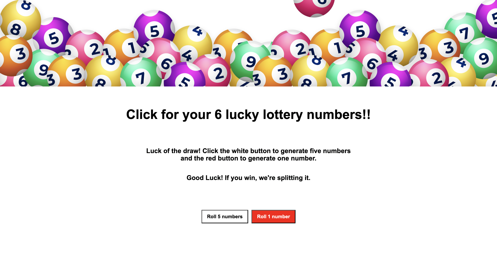

# Feeling-lucky?

**Link to project:** https://codefitness21.github.io/Feeling-lucky/

## How It's Made 
**Tech used:** HTML, CSS, JavaScript(JS)

The creation of this app was built to get in some extra practice using arrays, loops, and functions. I organized and designed it using a little bit of HTML and CSS and added JS to make it functional. The app allows users to play six random numbers and apply them to their purchased lottery ticket. Two separate buttons were created for this task - one to generate five numbers and the other to generate one number. Why? The first five numbers range from 1 - 69, and the sixth number ranges from 1-26, which is the powerball number. To do this, two separate functions were created with an add.EventListener appended to both of them. Within that function exists an empty array that will return a new set of five numbers and one new number every time the buttons are clicked, contingent upon the number set in the for loop and the Math.random method set within that for loop. The final result of six numbers appears above the buttons. 

## Optimizations
Eventually, I want one button that handles both sets of numbers, so when the user clicks on the button, the six numbers appear within their respective range. 
 
 
